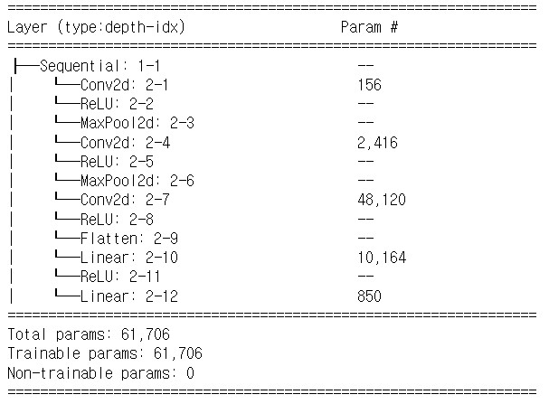
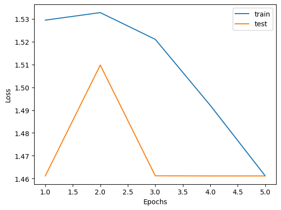
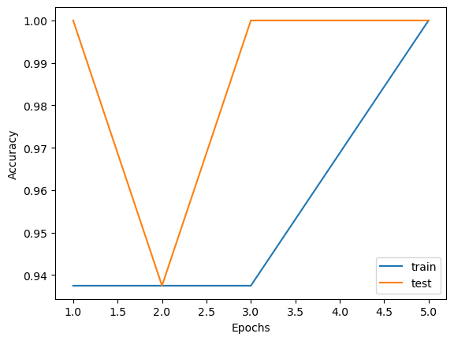

# MNIST & Modified LeNet-5
## What Is MNIST and Goal For This Project
* The MNIST dataset is a large database of handwritten digits that is commonly used for training various image processing systems. It contains 60,000 images of training set and 10,000 images of test set. The handwritten digit images have been size-normalized and centered in a fixed size of 28×28 pixels. 
* I slightly modified LeNet-5 model to train these images and resized the images to 32x32 pixels beforehand. Adam optimizer, Cross Entropy Loss, and batch size of 64 were used for this task.
<div align="center"></div>
<p align="center"> [MNIST Dataset] </p>

## LeNet-5 Architecture
<div align="center"></div>
<p align="center">[LeNet-5 Original Architecture]</p>  
<p></p>
LeNet-5 is a very efficient convolutional neural network for handwritten character recognition. It is a small network that has 7 layers and contains basic modules of deep learning: convolutional layer, pooling layer and fully connected layer. Moreover, LeNet-5 uses average pooling and tanh activation function. However, in this project I will use max-pooling and ReLU activation function. The rest of the configurations are similar to base architecture. 
<p></p>
<p align="center"> Modified LeNet-5 Architecture Code </p>  

```shell
class LeNet(nn.Module):
    def __init__(self):
        super().__init__()
        self.network = nn.Sequential(
            nn.Conv2d(in_channels = 1, out_channels = 6, kernel_size = 5),
            nn.ReLU(),
            nn.MaxPool2d(2, stride = 2),
            
            nn.Conv2d(in_channels = 6, out_channels = 16, kernel_size = 5),
            nn.ReLU(),
            nn.MaxPool2d(2, stride = 2),
            
            nn.Conv2d(in_channels = 16, out_channels = 120, kernel_size = 5),
            nn.ReLU(),
            
            nn.Flatten(),
            
            nn.Linear(120, 84),
            nn.ReLU(),
            
            nn.Linear(84,10))
    
    def forward(self, x):
        x = self.network(x)
        return F.softmax(x, dim=1)  
```
<h2 align="center">LeNet-5 Parameters</h1>
<div align="center"></div>

### How to calculate parameters for each layer
Recall that there are no trainable parameters in max-pooling layers and ReLU activation functions
* Conv2d (2-1):  ((5x5x1)+1)  x 6 = 156
* Conv2d (2-4):  ((5x5x6)+1)  x 16 = 2416
* Conv2d (2-7):  ((5x5x16)+1) x 120 = 48120
* Linear (2-10): (120+1)      x 84 = 10164
* Linear (2-12): (84+1)       x 10 = 850
 
### Graph
<p align="center" width="100%">
     
     
</p>
By looking at those graphs, we can get very high accuracy in few epochs.

## Demo
Download the MNIST-LeNet-5.ipynb file I provided to you and try run it using jupyter notebook
