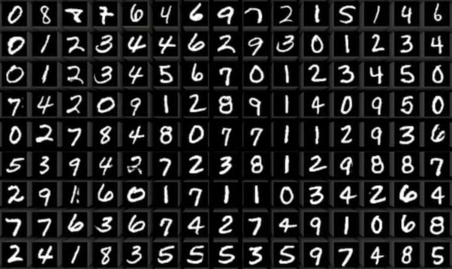
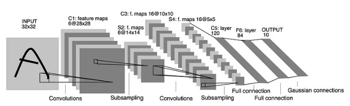

# MNIST & LeNet-5
## What Is MNIST and Goal For This Project
* The MNIST dataset is a large database of handwritten digits that is commonly used for training various image processing systems. It contains 60,000 images of training set and 10,000 images of test set. The handwritten digit images have been size-normalized and centered in a fixed size of 28×28 pixels. 
* I will use slightly modified LeNet-5 Model to train these images and resized the images to 32x32 pixels.

 MNIST Dataset 

## Modified LeNet-5 Architecture

